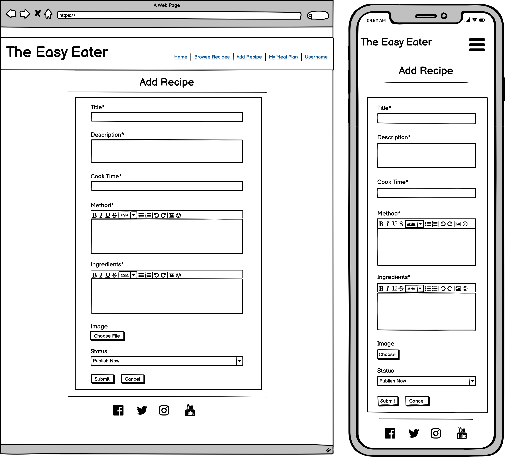
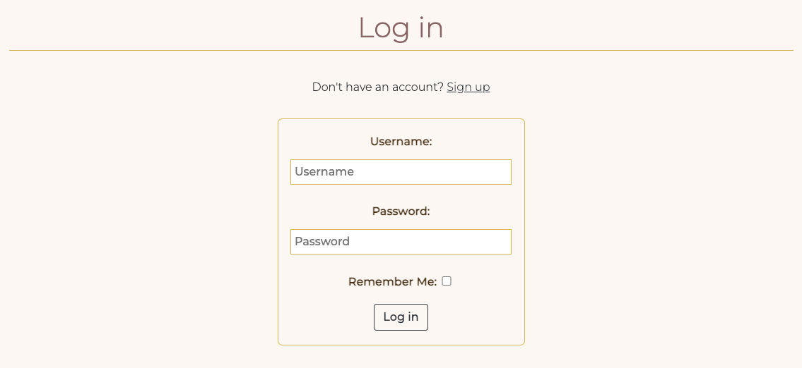

# The Easy Eater

The Easy Eater is a meal planning app which is designed to take the stress out of everyday cooking. The app is targeted towards users who enjoy their food and trying new recipes but also want to save time and effort when deciding what to cook for dinner every night of the week!

The site acts as a respository for recipes whereby users can store their own recipes and also browse other user's recipes and bookmark them for a later date. User's can get organised for the week ahead by adding recipes to their mealplanner for each day of the week. 

The live link can be found here - [The Easy Eater](https://easy-eater.herokuapp.com/)

AM I RESPONSIVE IMAGE HERE

## Table of Contents

## User Experience (UX)

A visitor to Easy Eater would be someone who is most likely an adult who enjoys their food and trying new recipes but also wants to save time and effort when deciding what to cook for dinner every night of the week.

## User Stories

### EPIC | User Profile
- As a Site User I can register an account so that I can add/edit/delete my recipes and comment on and bookmark other people's recipes and add recipes to my mealplanner.
- As a Site User, I can login or logout of my account so that I can keep my account secure.
- As a Site User I can see my login status so that I know if I'm logged in or out.

### EPIC | User Navigation
- As a User I can immediately understand the purpose of the site so that I can decide if it meets my needs.
- As a user, I can intuitively navigate around the site so that I can find content and understand where I am on the site.
- As a Site User, I can view a paginated list of recipes so that I can select a recipe to view.
- As a Site User, I can click on a recipe so that I can read the full recipe,ingredients required and view comments left by users.
- As a Site User, I can search recipes so that I can find the one I want. NOT YET IMPLEMENTED.

### EPIC | Recipe Management
- As a Site User, I can input my favourite recipes onto the app through an easy to use interface so that I can share them with other users.
- As a Site User, I can edit and delete recipes that I have created so that I can easily make changes without having to start over.
- As a Site User I can view my recipes so that I can see and manage all recipes I have created in the one location.
- As a Site User I can view my bookmarked recipes so I can find them easily in the one location.

### EPIC | Recipe Interaction
- As a Site User, I can save other user's recipes to my bookmarks so that I can find them easily at a later date.
- As a Site User, I can comment on other people's recipes so I can give my feedback.
- As a Site User, I can edit and delete comments that I have created so that I can easily make changes if I have made a mistake.

### EPIC | Mealplan Management
- As a Site User, I can add/delete recipes to my meal planner for a particular day of the week so that I can create a meal plan for the week ahead.
- As a Site User, I can view my meal plan for the week when I log into my account so that I can plan for the week ahead.
- As a Site User, I can export the ingredients from the recipes on my meal plan to a shopping list and remove the ones that are not necessary so that I can have all my required ingredients for the week in one place.

### EPIC | Site Administration
- As a Site Administrator, I can create, read, update and delete recipes, comments and meal plan items so that I can manage the app content.

## Agile Methodology

Github projects was used to manage the develop process using an agile approach. Please see link to project here. INSERT LINK

The 6 Epics listed above were documented within the Github project as Milestones. A Github Issue was created for each User Story which was then allocated to a milestone(Epic). Each User Story has defined acceptance criteria to make it clear when the User Story has been completed. The acceptance criteria are further broken down into tasks to facilitate the User Story's execution.

### Design

The site has a very simple and clean design which was purposely chosen in order to keep in theme with the site's goal. i.e. invoking a sense of calm in the user and reducing stress when it comes to everyday cooking. 

### Colour Scheme
Colour palette from Coolors

The colour scheme of the site is mainly mainly pale cream, pink and brown with thin gold borders. THe colours chosen are quite neutral and calming. 

Great care was taken to establish a good contrast between background colours and text at all times to ensure maximum user accessibility. 

### Imagery
There is only one static image on the site depicting a family dinner on the home page. The rest of the imagery will be uploaded by users for their individual recipes. 

### Fonts
The Montserrat font is the main font used used for the body of the website with the Playfair Display font used for the main headings on the home page. These fonts were imported via Google Fonts. Sans Serif is the backup font, in case for any reason the main font isn't being imported into the site correctly.

### Wireframes

 
Landing Page

Browse Recipes

Add Recipe

My Recipes

My Bookmarks

## Data Model
I used principles of Object-Oriented Programming throughout this project and Django’s Class-Based Generic Views.  

Django AllAuth was used for the user authentication system.

In order for the users to create Recipes a custom recipe model was required. The recipe author is a foreign key to the User model given a recipe can only have one author.

The Comment model allows users to comment on individual recipes and the Recipe is a forign key in the comment model given a comment can only be linked to one recipe. 

The meal plan item model allows users to add recipes to a meal plan for a particular day. A meal plan item can only have one user and one recipe and is therefore linked to the User and Recipe models through foreign keys.

The diagram below details the database schema.

## Security Features and Defensive Design

### User Authentication

- Django's LoginRequiredMixin is used to make sure that any requests to access secure pages by non-authenticated users are redirected to the login page. 
- Django's UserPassesTestMixin is used to limit access based on certain permissions i.e. to ensure users can only edit/delete recipes and comments for which they are the author. If the user doesn't pass the test they are shown an HTTP 403 Forbidden error.

### Form Validation
If incorrect or empty data is added to a form, the form won't submit and a warning will appear to the user informing them what field raised the error. 

### Database Security
The database url and secret key are stored in the env.py file to prevent unwanted connections to the database and this was set up before the first push to Github.

Cross-Site Request Forgery (CSRF) tokens were used on all forms throughout this site.

### Custom error pages:

Custom Error Pages were created to give the user more information on the error and to provide them with buttons to guide them back to the site.

400 Bad Request - The Easy Eater is unable to handle this request.
403 Page Forbiden - Looks like you're trying to access forbidden content. Please log out and sign in to the correct account.
404 Page Not Found - The page you're looking for doesn't exist.
500 Server Error - The Easy Eater is currently unable to handle this request

## Features

### Header

- **Logo**
    - A customised logo was created using Hatchful by Shopify which is a free logo generator.
    - This logo is positioned in the top left of the navigation bar. The logo is linked to the home page for ease of navigation for the user.

- **Navigation Bar**

    - The navigation bar is present at the top of every page and includes all links to the various other pages.
    - The My Account navigation link is a drop down menu which includes the Sign up and Log in links. 
    - When the user has logged in, the My Account drop down menu changes to display the user's name and a profile icon.

    

    - The options to Sign up or Log in will change to the option to log out once a user has logged in.
    - Once a user has signed in, more options such as 'Add Recipe', 'My Meal Plan', 'My Recipes' and 'My Bookmarks' become available.
    - The navigation bar is fully responsive, collapsing into a hamburger menu when the screen size becomes too small.
    - Hovering over the links will lighten the font.

### Footer

- The footer section includes links to Facebook, Instagram, Twitter and Youtube.
- Clicking the links in the footer opens a separate browser tab to avoid pulling the user away from the site.

### Home Page

- **Call to Action Section**

    - The home page includes a call to action section which encourages the user to sign up to the site with the message "Take the stress out of everyday cooking!" and an image of a family dinner.
    - The CTA includes a sign up button button which takes the user to the sign up page.
    - If a user is already signed in the message changes to 'Welcome back to The Easy Eater' and the user is encouraged to create a new recipe.
    - The sign up button changes to a 'Create' button which takes the user to the 'Add recipe' page. 

    
- **What We Do Section**

    - The "What We Do' section gives a brief overview of what the site has to offer and summarises the basic features with three simple steps illustrated with font-awesome icons.

### User Account Pages

- **Sign Up**

- **Log In**

- **Log Out**

    - Django allauth was installed and used to create the Sign up, Log in and Log out functionality. 
    - Success messages inform the user if they have logged in/ logged out successfully.

### Browse Recipes

- This page displays all recipes with a status of published with the most recent recipes displaying first.
- The recipes cards are paginated after every 8 recipes. 
- Each card displays the recipe's image, Title and Cook Time. 
- Clicking anywhere inside the recipe card will take you directly to that recipe's detailed page.

### Recipe Detail Page
- **Recipe Header Section**
 
 The recipe header section at the top of the page shows the recipe image, title, author, prep time and cook time.

- **Recipe Action Buttons**

    The following buttons will display if the user is logged in:

    

    - Add to Meal Plan Button - Clicking on the button opens the Meal Plan Modal (see below).
    - Bookmark button - Clicking the outlined bookmark button renders the recipe 'bookmarked' by the user which will then fill bookmark icon and add the recipe to the user's bookmarks page. Clicking the button again will remove the recipe from the user's bookmarks and turn the icon back to an outline.

    The following buttons will display if the user is logged in and is the recipe author:

    

    - Update Recipe Button - Clicking the button opens the update recipe form prepopulated with the current recipe details.
    - Delete Recipe Button - Clicking the button opens the confirm delete recipe page. 

- **Meal Plan Modal**

    

    - The meal plan modal includes a form which allows the user to select a day of the week.
    - Once the user clicks the add to meal plan button, the recipe is added to the user's meal plan for the selected day.
    - Only one recipe can be added per day so if a user already has a meal plan item for a particular day, adding another one will over write the existing one. 
    - The user receives a success message notifiying them that the recipe has been successfully added to their meal plan.

- **Recipe Details Section**
    - The main body of the page consists of the recipe description, ingredients, and method. 

- **Comments Section**
    
    

    - The comments section lists all comments left by user's for that particurly recipe.
    - Comments can only be left if a user is logged in. Any comments left by the user that is currently signed in can be updated or deleted using the buttons in the comment header. 
    
    
    
    - The user receives a success message notifiying them that the comment has been successfully added, updated or deleted.
    - If a user tries to edit or delete a comment (by changing the url) without being signed in they are redirected to the log in page.
    - If a user tries to edit/delete another user's comment (by changing the url) they receive a custom 403 error.

### Add Recipe Form

- If the user is logged in, then they can add a recipe by clicking the link on the navigation bar.
- The form fields for 'Ingredients' and 'Method' include a WYSIWYG editor called Summernote to help the user format their content by adding bullet points, headings etc.
- The user can upload a photo if they wish. If they choose not to, a default image displays as their recipe image.
- The user can choose to publish the recipe now or save for later through a drop down menu. If they choose to 'save for later', the recipe will not appear on the Browse Recipe page but the user will be able to access it in their 'My Recipes' page.
- Failing to fill out recipe's Title, Description, Ingredients, or Method, results in the form failing and rendering a message stating which fields you have missed.
- If a user tries add a recipe (by changing the url) without being signed in they are redirected to the log in page.
- The user will receive a success message notifiying them that the recipe has been successfully added.

### Update Recipe Form
- If the user is logged in and is the author or the recipe they can choose to edit the recipe by clicking the edit button in the recipe detail page. 
- The form opens with all fields populated with the original content.
- If a user tries to update a recipe (by changing the url) without being signed in they are redirected to the log in page.
- If a user tries to update another user's recipe (by changing the url) they receive a custom 403 error.
- The user will receive a success message notifiying them that the recipe has been successfully updated.

### Delete Recipe
 
- If the user is logged in and is the author or the recipe they can choose to delete the recipe by clicking the delete button in the recipe detail page.  
- The user is asked to confirm if they wish to delete the recipe or cancel.
- The user will receive a success message notifiying them that the recipe has been successfully deleted.

### My Meal Plan
- This page displays the logged in user's meal plan for the week.
- The meal plan cards are ordered Monday to Sunday. 
- If a user has added a recipe to their meal plan for a particular day, the card will display the recipe image and title. Clicking anywhere inside the meal plan card will take you directly to that recipe's detailed page.
- If there is no meal plan for a particular day, that card will display a plus icon and the text "Add Recipe". Clicking anywhere inside the meal plan card will take you to the browse recipes page.
- If a user tries to access this page (by changing the url) without being signed in they are redirected to the log in page.

### My Recipes Page

- This page displays all recipes which the logged in user has created.
- The recipes cards are paginated after every 8 recipes. 
- Each card displays the recipe's image, Title and Cook Time. 
- If the recipe is not yet published the word 'DRAFT' will appear in red next to the recipe title.
- Clicking anywhere inside the recipes card will take you directly to that recipes detailed page.
- If a user tries to access this page (by changing the url) without being signed in they are redirected to the log in page.

### My Bookmarks Page

- This page displays all recipes which the logged in user has added to their bookmarks.
- Clicking anywhere inside the recipes card will take you directly to that recipes detailed page.
- If a user tries to access this page (by changing the url) without being signed in they are redirected to the log in page.

### Error Pages

Custom Error Pages were created to give the user more information on the error and to guide them back to the site.

- 400 Bad Request - The Easy Eater is unable to handle this request.
- 403 Page Forbiden - Looks like you're trying to access forbidden content. Please log out and sign in to the correct account.
- 404 Page Not Found - The page you're looking for doesn't exist.
- 500 Server Error - The Easy Eater is currently unable to handle this request

### Future Features
Searching and filtering
Vegan / vegetarian
Meal plan breakfast and lunch / snacks
Ingredients list and shopping list. 

## Deployment - Heroku

To deploy this page to Heroku from its GitHub repository, the following steps were taken:

### Create the Heroku App:
- Log in to [Heroku](https://dashboard.heroku.com/apps) or create an account.
- On the main page click the button labelled New in the top right corner and from the drop-down menu select "Create New App".
- Enter a unique and meaningful app name.
- Next select your region.
- Click on the Create App button.

### Attach the Postgres database:
- In the Resources tab, under add-ons, type in Postgres and select the Heroku Postgres option.
- Copy the DATABASE_URL located in Config Vars in the Settings Tab.

### Prepare the environment and settings.py file:
- In your GitPod workspace, create an env.py file in the main directory.
- Add the DATABASE_URL value and your chosen SECRET_KEY value to the env.py file. 
- Update the settings.py file to import the env.py file and add the SECRETKEY and DATABASE_URL file paths.
- Comment out the the default database configuration.
- Save files and make migrations.
- Add Cloudinary URL to env.py
- Add the cloudinary libraries to the list of installed apps.
- Add the STATIC files settings - the url, storage path, directory path, root path, media url and default file storage path.
- Link the file to the templates directory in Heroku.
- Change the templates directory to TEMPLATES_DIR
- Add Heroku to the ALLOWED_HOSTS list the format ['app_name.heroku.com', 'localhost']

### Create files / directories
- Create requirements.txt file
- Create three directories in the main directory; media, storage and templates.
- Create a file named "Procfile" in the main directory and add the following: web: gunicorn project-name.wsgi

### Update Heroku Config Vars
Add the following Config Vars in Heroku:
- SECRET_KEY value 
- CLOUDINARY_URL
- PORT = 8000
- DISABLE_COLLECTSTATIC = 1

### Deploy
- NB: Ensure in Django settings, DEBUG is False
- Go to the deploy tab on Heroku and connect to the GitHub, then to the required repository. 
- Scroll to the bottom of the deploy page and either click Enable Automatic Deploys for automatic deploys or Deploy Branch to deploy manually. Manually deployed branches will need re-deploying each time the repo is updated.
- Click View to view the deployed site.

The site is now live and operational.
## Forking this repository
- Locate the repository at this link [The Easy Eater](https://github.com/AliOKeeffe/PP4_My_Meal_Planner).
- At the top of the repository, on the right side of the page, select "Fork" from the buttons available. 
- A copy of the repository is now created.

## Cloning this repository
To clone this repository follow the below steps: 

1. Locate the repository at this link [The Easy Eater](https://github.com/AliOKeeffe/PP4_My_Meal_Planner). 
2. Under **'Code'**, see the different cloning options, HTTPS, SSH, and GitHub CLI. Click the prefered cloning option, and then copy the link provided. 
3. Open **Terminal**.
4. In Terminal, change the current working directory to the desired location of the cloned directory.
5. Type **'git clone'**, and then paste the URL copied from GitHub earlier. 
6. Type **'Enter'** to create the local clone. 

Languages:

- Python
- HTML
- CSS
- Javascript

### Frameworks - Libraries - Programs Used
- [Django](https://www.djangoproject.com/): Main python framework used in the development of this project
- [Django-allauth](https://django-allauth.readthedocs.io/en/latest/installation.html): authentication library used to create the user accounts
- [PostgreSQL](https://www.postgresql.org/) was used as the database for this project.
- [Heroku](https://dashboard.heroku.com/login) - was used as the cloud based platform to deploy the site on.
- [Am I Responsive](http://ami.responsivedesign.is/) - Used to verify responsiveness of website on different devices.
- [Responsinator](http://www.responsinator.com/) - Used to verify responsiveness of website on different devices.
- [Balsamiq](https://balsamiq.com/) - Used to generate Wireframe images.
- [Chrome Dev Tools](https://developer.chrome.com/docs/devtools/) - Used for overall development and tweaking, including testing responsiveness and performance.
- [Font Awesome](https://fontawesome.com/) - Used for icons in information bar.
- [GitHub](https://github.com/) - Used for version control and agile tool.
- [Google Fonts](https://fonts.google.com/) - Used to import and alter fonts on the page.
- [W3C](https://www.w3.org/) - Used for HTML & CSS Validation.
- [PEP8 Online](http://pep8online.com/) - used to validate all the Python code
- [Jshint](https://jshint.com/) - used to validate javascript
- [Coolors](https://coolors.co/) - Used to create colour palette.
- [Favicon](https://favicon.io/) - Used to create the favicon.
- [Lucidchart](https://lucid.app/documents#/dashboard) - used to create the database schema design
- [Grammerly](https://app.grammarly.com/) - used to proof read the README.md
- [Summernote](https://summernote.org/): A WYSIWYG editor to allow users to edit their posts
- [Techsini](https://techsini.com/multi-mockup/index.php) - Site mockup generator
- [Crispy Forms](https://django-crispy-forms.readthedocs.io/en/latest/) used to manage Django Forms
- [Cloudinary](https://cloudinary.com/): the image hosting service used to upload images

hatchful by shopify
BOOTSTRAP 4.6

## Credits
family dinner picture
placeholder chopsticks pexels valeria burdyka
https://www.tablesgenerator.com/markdown_tables
stack overflow
slack channel
- [W3Schools](https://www.w3schools.com/)  
- [Stack Overflow](https://stackoverflow.com/)
Django Docs
- Code Institute blog walkthrough - 
- [Update View](https://pytutorial.com/django-updateview-example)
- [PAGINATION](https://docs.djangoproject.com/en/2.2/topics/pagination/#using-paginator-in-a-view)
- [autoslugfield](https://django-extensions.readthedocs.io/en/latest/field_extensions.html)
- [Bootstrap 4.6](https://getbootstrap.com/docs/4.6/getting-started/introduction/)
- [Ian Meigh Customer Validator function]

## Acknowledgments

The Code Institute slack community for their quick responses and very helpful feedback!
