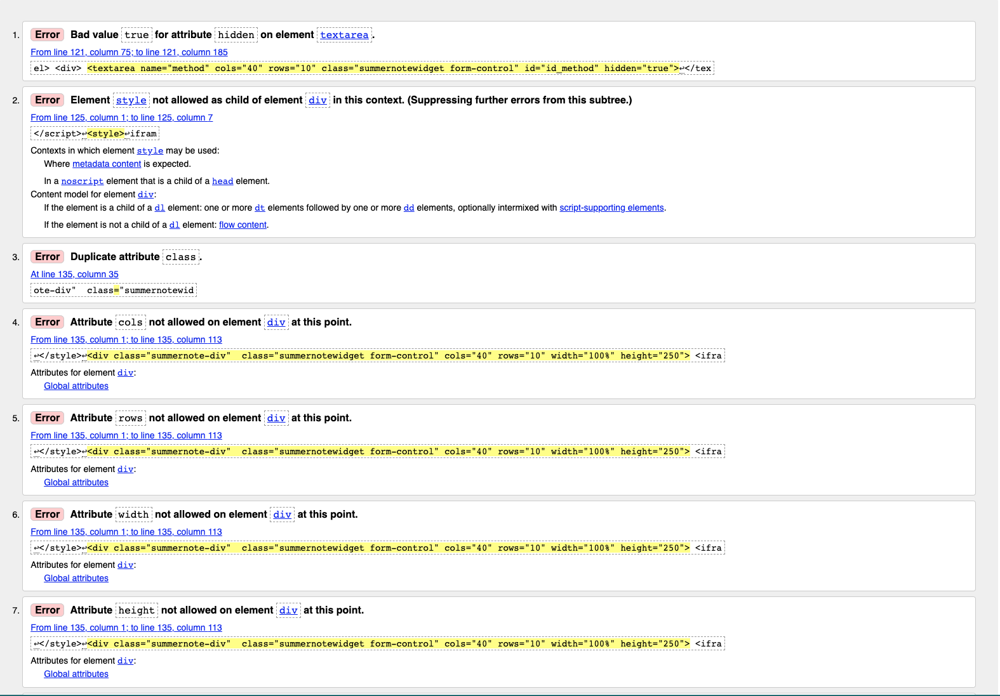
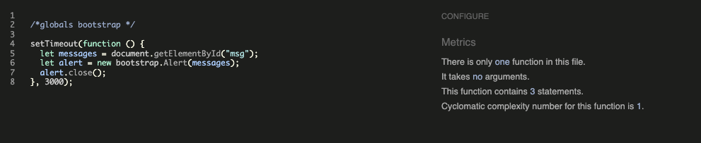

## Validators

### HTML

All HTML pages were run through the [W3C HTML Validator](https://validator.w3.org/). The following errors were flagged.

Fixed Errors:
- When validating the Recipe Detail page I received an error in relation to an extra `
` tag in the 'Recipe Method' field which had been created using the summernote editor. The issue was due to Summernote including `
` tags around the form field. I resolved the error by removing the surrounding `
` tags in my HTML when rendering a summernote field in my Recipe Detail page.

Unfixed Errors
- When validating the Add Recipe and Edit Recipe forms I received a number of errors which were caused by the installed Summernote library which runs when using the form on these pages. I could not recitify these errors given that they weren't in my own code therefore they are unresolved. 

 

 
Summernote Errors

 

### CSS
- No errors were found when passing my CSS file through the official W3C CSS Validator 
     - [W3C CSS Validator](https://jigsaw.w3.org/css-validator/)  ADD IN RESULTS

### Javascript
 No errors were found when passing my javascript through [Jshint](https://jshint.com/) 

 

 
Jshint

 

### Python
All Python files were ran through [Pep8](http://pep8online.com/) with no errors found. 

### Lighthouse

Lighthouse validation was ran on all pages (both mobile and desktop) in order to check accessibility.
At first I recieved the warning *'Background and foreground colors do not have a sufficient contrast ratio'* in relation to buttons where I had used the Bootstrap class `btn-info`. 

After I updated the button styling I received 100% score on all pages. 

## User Story Testing

### EPIC | User Profile
*As a Site User I can register an account so that I can add/edit/delete my recipes and comment on and bookmark other people's recipes and add recipes to my mealplanner.*
- A sign up button is immediately visible on the landing page as a call to action for the user to sign up to get started. When the user clicks the button they are taken to the sign up page.
- There is also a sign up button in the My Account drop down menu in the Nav bar.
- Once the user has registered an account they can perform all the actions listed above.

*As a Site User, I can login or logout of my account so that I can keep my account secure.*
- If the user has registered an account they can access the login and logout buttons in the My Account section of the Navbar. 

*As a Site User I can see my login status so that I know if I'm logged in or out.*
- Once the user has logged into their account their username displays on the Navbar beside a profile icon.
### EPIC | User Navigation
 *As a User I can immediately understand the purpose of the site so that I can decide if it meets my needs*
- In the center of the landing page there is a section entitled "What We Do' which gives a brief overview of what the site has to offer and summarises the basic features with three simple steps illustrated with font-awesome icons.

*As a user, I can intuitively navigate around the site so that I can find content*
- A navigation bar is visible on every page of the site which is fully responsive on different screen sizes.

*As a Site User, I can view a paginated list of recipes so that I can select a recipe to view.*
- The Browse Recipes page displays a paginated list of all recipes in the database with a status of published. 

*As a Site User, I can click on a recipe so that I can read the full recipe,ingredients required and view comments left by users.*
- Clicking anywhere inside the recipe card will take you directly to that recipe's detailed page which displays the full recipe details including description, ingredients and method. 
- A list of comments is displayed underneath the recipe details.

*As a Site User, I can search recipes so that I can find the one I want. NOT YET IMPLEMENTED.*

### EPIC | Recipe Management
*As a Site User, I can input my favourite recipes onto the app through an easy to use interface so that I can share them with other users.*
- Once the user has logged in, a create recipe button is immediately visible on the landing page as a call to action for the user to add a recipe. When the user clicks the button they are taken to the add recipe form.
- There is also a Add Recipe button on the Nav bar which is visible on every page.
- Once the user has filled out the form details they can choose to 'Publish Recipe Now' which adds the recipe to the Browse Recipes page.

*As a Site User, I can edit and delete recipes that I have created so that I can easily make changes without having to start over.*
- If the logged in user is the recipe author, edit and delete recipe icon buttons will display on the recipe detail page for each recipe allowing the user to edit and delete their recipes.

*As a Site User I can view my recipes so that I can see and manage all recipes I have created in the one location.*
- All the user's created recipes are available to see on the 'My Recipes' page.

*As a Site User I can view my bookmarked recipes so I can find them easily in the one location.*
- All the user's bookmarked recipes are available to see on the 'My Bookmarks' page.

### EPIC | Recipe Interaction
*As a Site User, I can save other user's recipes to my bookmarks so that I can find them easily at a later date.*
- Each recipe has a bookmark button which can be toggled by signed in users to bookmark the recipe or remove from bookmarks.

*As a Site User, I can comment on other people's recipes so I can give my feedback.*
- Each recipe has a comment section where logged in user's can leave comments on the recipe.

*As a Site User, I can edit and delete comments that I have created so that I can easily make changes if I have made a mistake.*
- If the logged in user is the comment author, edit and delete icon buttons will display in the comment header allowing the user to edit or delete their comments.

### EPIC | Mealplan Management
*As a Site User, I can add/delete recipes to my meal planner for a particular day of the week so that I can create a meal plan for the week ahead.*
- Each recipe has an 'Add to Meal Plan' button which only displays if the user is logged in. 
- The user can choose which day of the week they want to add the recipe through a drop down menu.
- The recipe will display in the user's meal plan for the day selected.

*As a Site User, I can view my meal plan for the week when I log into my account so that I can plan for the week ahead.*
- All the user's meal plan items are available to see on the 'My Meal Plan' page.

*As a Site User, I can export the ingredients from the recipes on my meal plan to a shopping list and remove the ones that are not necessary so that I can have all my required ingredients for the week in one place.*

### EPIC | Site Administration
*As a Site Administrator, I can create, read, update and delete recipes, comments and meal plan items so that I can manage the app content*
-  Admins have full access to CRUD functionality for all recipes, comments and meal plans in the admin panel.

## Manual Testing

### Site Navigation

| **Element**           | **Action** | **Expected Result**                                                | **Pass/Fail** |
|-----------------------|------------|--------------------------------------------------------------------|---------------|
| **Navbar**            |            |                                                                    |               |
| Site Name (logo area) | Click      | Redirect to home                                                   | Pass          |
| Home Link             | Click      | Redirect to home                                                   | Pass          |
| Browse Recipes Link   | Click      | Open Browse Recipes Page                                           | Pass          |
| Add Recipe Link       | Click      | Open Add Recipe Form                                               | Pass          |
| Add Recipe Link       | Display    | Only visble if user in session                                     | Pass          |
| My Meal Plan Link     | Click      | Open My Meal Plan page                                             | Pass          |
| My Meal Plan Link     | Display    | Only visble if user in session                                     | Pass          |
| My Account Dropdown   | Click      | Open My Account dropdown                                           | Pass          |
| My Account Dropdown   | Display    | Text changes to username with profile icon when user is in session | Pass          |
| Sign Up Link          | Click      | Open Sign up page                                                  | Pass          |
| Sign Up Link          | Display    | Not visible if user in session                                     | Pass          |
| Log In Link           | Click      | Open Log in page                                                   | Pass          |
| Log In Link           | Display    | Not visible if user in session                                     | Pass          |
| My Recipes Link       | Click      | Open My Recipes page                                               | Pass          |
| My Recipes Link       | Display    | Only visible if user in session                                    | Pass          |
| My Bookmarks Link     | Click      | Open My Bookmarks page                                             | Pass          |
| My Bookmarks Link     | Display    | Only visible if user in session                                    | Pass          |
| Logout Link           | Click      | Open logout confirm page                                           | Pass          |
| Logout Link           | Display    | Only visible if user in session                                    | Pass          |
| All Nav Links         | Hover      | Darken text                                                        | Pass          |
| All Nav Links         | If active  | Keep active link dark and bold                                     | Pass          |
| Navbar                | Scroll     | Remains fixed to top of page                                       | Pass          |

### Home Page

### Browse Recipes Page
### Recipe Detail Page
### Add Recipe Page
### Edit Recipe Page
### Confirm Delete Recipe Page
### My Recipes Page
### My Bookmarks Page
### My Meal Plan Page
### Django All Auth Pages

## Bugs 

### Fixed Bugs

- #### Overwrite Meal Plan Items
     - **Bug**: When I initially wrote the code to add a recipe to a meal plan item, if a meal plan item already existed for the current user for a particular day and then they added another recipe to that day, the meal plan item wouldn't update and the the user's meal plan would still display the original meal plan item for that day.
     - **Fix**: in order to rectify this I queried the database to return all meal plan items for the current user and for the day selected. Through an if statement I could then check if a meal plan item already existed for the user for that day, and if it did then to overwrite it. 
This solved the problem whereby now if a user adds a meal plan item to a particular day, it just overwrites the previous meal plan item. 

- #### Required fields using Summernote extension submit with just whitespace entered
     - **Bug**: In the Add Recipe form, the Ingredients and Method fields both use the summernote extension. Both fields are required fields however the form still submited when only whitespace was entered due to summernote rendering the html `
&nbsp; &nbsp; &nbsp; &nbsp; &nbsp;&nbsp;
` on submit and therefore the form validation didn't pick up the empty field. 
     - **Fix**: My first attempt at the solution was to write a custom django `clean_<fieldname>() method` which would replace any `&nbsp` with blank, `strip()` whitespace and `strip_tags()`. The solution did prevent the form submiting with only whitespace however it wasn't a good solution due to fact that stripping the HTML tags meant the summernote editor didn't format valid inputs as expected. 
     - After posting the question on Slack Ian Meigh_5P proposed a working solution to create a custom validator for textfields and implement this in the Model. I have utilised Ian's  custom validator in my code (see validators.py) and have credited him in my Readme. Thanks Ian!

- #### No Reverse Match Error
     - **Bug**: When I first implemented the Add Recipe form I kept getting a no reverse match error when trying to submit a new recipe due to the slug field not populating properly. 
     - **Fix**: After some research on stack overflow I learned about AutoSlugField which is a Django Model Field extension which will automatically create a unique slug and you can choose which field to populate the slug from. Utilising this extension I was able to create a unique slug populated from the recipe title.

- #### Cloudinary Images not Displaying
     - **Bug**: Cloudinary images not displaying after uploading. 
     - **Fix**: After searching the issue on slack I realised that I needed to include enctype="multipart/form-data in the opening form HTML tag and this solved the problem. 

- #### Footer not staying at bottom of screen
     - **Bug**: Footer not staying at the bottom of the screen when displaying on pages without fullscreen content and didn't want to use a sticky footer. 
     - **Fix**: Was able to utilise the the calc() CSS function and make the page content 100% of the viewport height less the height of the footer and this solved the problem. 

### Unfixed bugs:

There are no known unfixed bugs. 
