# Table of Contents
- [User Story Testing](#user-story-testing)
- [Validator Testing](#validator-testing)
  * [HTML](#html)
    + [Fixed Errors](#fixed-errors)
    + [Unfixed Errors](#unfixed-errors)
  * [CSS](#css)
  * [Javascript](#javascript)
  * [Python](#python)
  * [Lighthouse](#lighthouse)
- [Browser Testing](#browser-testing)
- [Device Testing](#device-testing)
- [Manual Testing](#manual-testing)
  * [Site Navigation](#site-navigation)
  * [Home Page](#home-page)
  * [Browse Recipes Page](#browse-recipes-page)
  * [Recipe Detail Page](#recipe-detail-page)
  * [Add Recipe Page](#add-recipe-page)
  * [Edit Recipe Page](#edit-recipe-page)
  * [Confirm Delete Recipe Page](#confirm-delete-recipe-page)
  * [My Recipes Page](#my-recipes-page)
  * [My Bookmarks Page](#my-bookmarks-page)
  * [My Meal Plan Page](#my-meal-plan-page)
  * [Django All Auth Pages](#django-all-auth-pages)
- [Bugs](#bugs)
  * [Fixed Bugs](#fixed-bugs)
    + [Overwrite Meal Plan Items](#overwrite-meal-plan-items)
    + [Required fields using Summernote extension submit with just whitespace entered](#required-fields-using-summernote-extension-submit-with-just-whitespace-entered)
    + [No Reverse Match Error](#no-reverse-match-error)
    + [Cloudinary Images not Displaying](#cloudinary-images-not-displaying)
    + [Footer not staying at bottom of screen](#footer-not-staying-at-bottom-of-screen)
  * [Unfixed bugs:](#unfixed-bugs-)

<small><i><a href='http://ecotrust-canada.github.io/markdown-toc/'>Table of contents generated with markdown-toc</a></i></small>

## User Story Testing

### EPIC | User Profile
*As a Site User I can register an account so that I can add/edit/delete my recipes and comment on and bookmark other people's recipes and add recipes to my meal planner.*

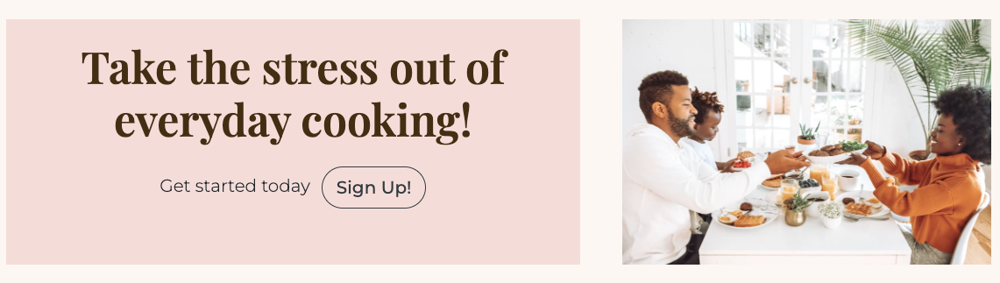

- A sign up button is immediately visible on the landing page as a call to action for the user to sign up to get started. When the user clicks the button they are taken to the sign up page.
- There is also a sign up button in the My Account drop down menu in the Nav bar.

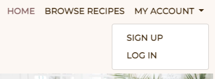

- Once the user has registered an account they can perform all the actions listed above.

*As a Site User, I can login or logout of my account so that I can keep my account secure.*
- If the user has registered an account they can access the login and logout buttons in the My Account section of the Navbar. 

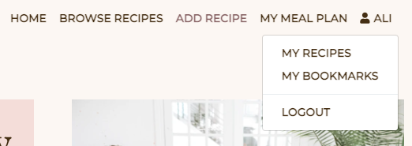

*As a Site User I can see my login status so that I know if I'm logged in or out.*
- Once the user has logged into their account their username displays on the Navbar beside a profile icon.

### EPIC | User Navigation
 *As a User I can immediately understand the purpose of the site so that I can decide if it meets my needs*
- In the centre of the landing page there is a section entitled "What We Do' which gives a brief overview of what the site has to offer and summarises the basic features with three simple steps illustrated with font-awesome icons.

*As a user, I can intuitively navigate around the site so that I can find content*
- A navigation bar is visible on every page of the site which is fully responsive on different screen sizes.

*As a Site User, I can view a paginated list of recipes so that I can select a recipe to view.*
- The Browse Recipes page displays a paginated list of all recipes in the database with a status of published. 

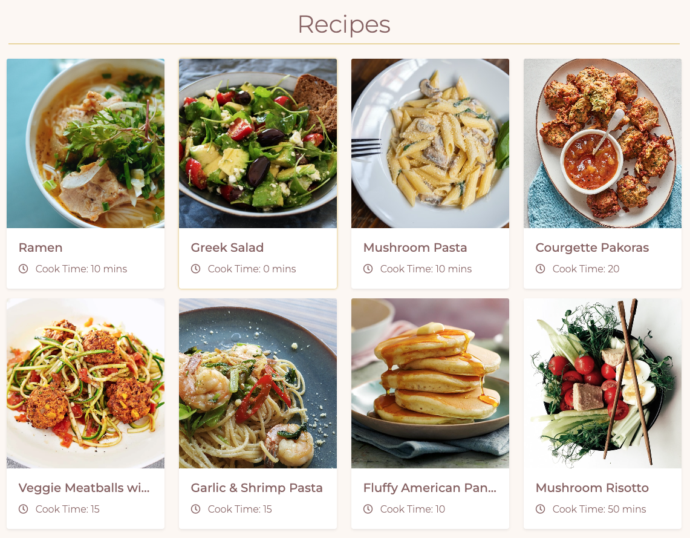

*As a Site User, I can click on a recipe so that I can read the full recipe, ingredients required and view comments left by users.*
- Clicking anywhere inside the recipe card will take you directly to that recipe's detailed page which displays the full recipe details including description, ingredients and method. 

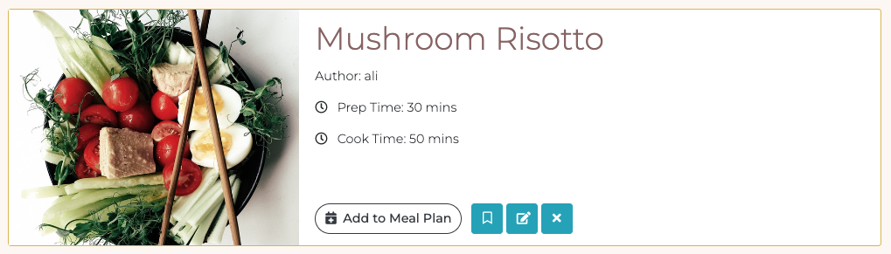

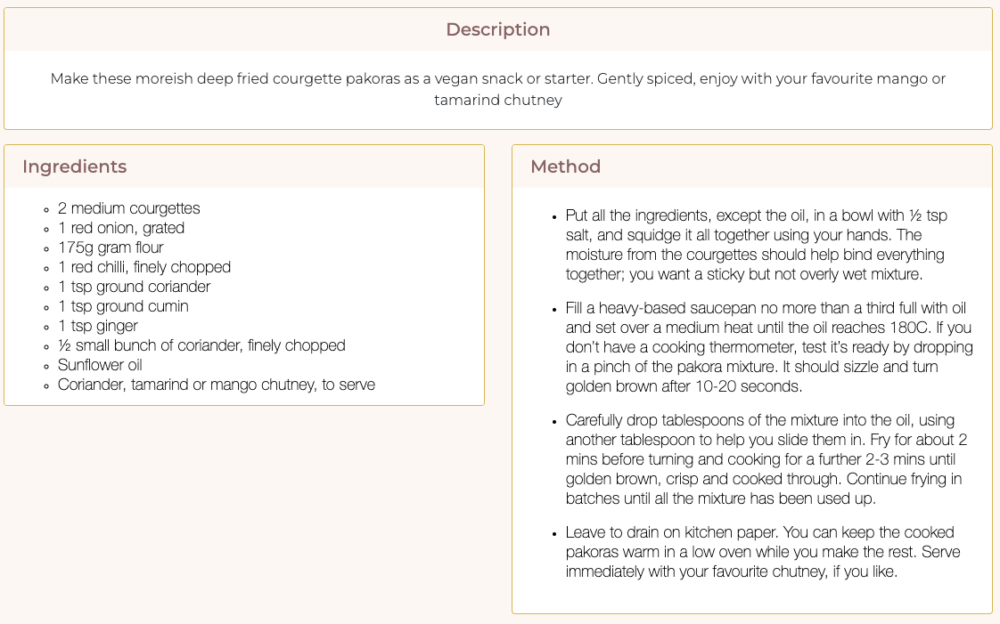

- A list of comments is displayed underneath the recipe details.

### EPIC | Recipe Management
*As a Site User, I can input my favourite recipes onto the app through an easy to use interface so that I can share them with other users.*
- Once the user has logged in, a create recipe button is immediately visible on the landing page as a call to action for the user to add a recipe. When the user clicks the button they are taken to the add recipe form.

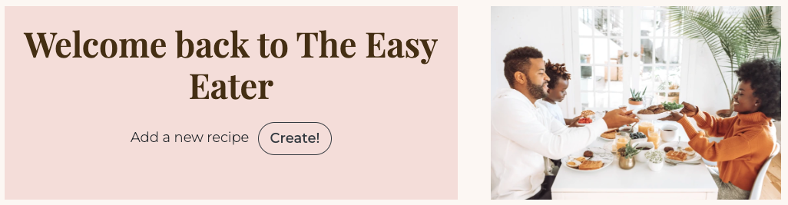

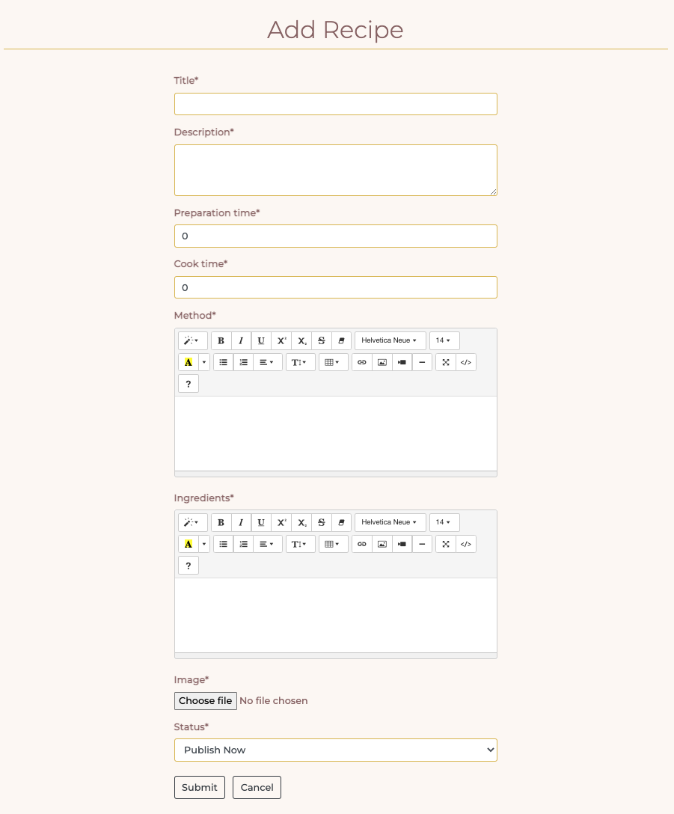

- There is also an 'Add Recipe' button on the Nav bar which is visible on every page.

- Once the user has filled out the form details they can choose to 'Publish Recipe Now' which adds the recipe to the Browse Recipes page.

*As a Site User, I can edit and delete recipes that I have created so that I can easily make changes without having to start over.*
- If the logged in user is the recipe author, edit and delete recipe icon buttons will display on the recipe detail page for each recipe allowing the user to edit and delete their recipes.

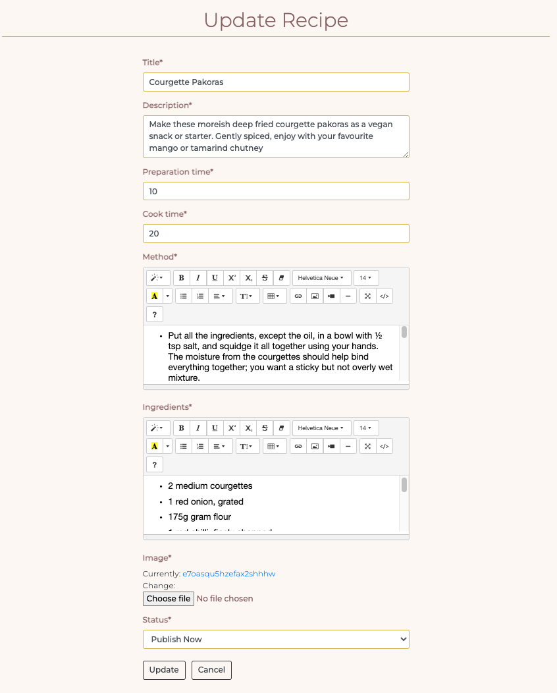

*As a Site User, I can view my recipes so that I can see and manage all recipes I have created in the one location.*
- All the user's created recipes are available to see on the 'My Recipes' page.

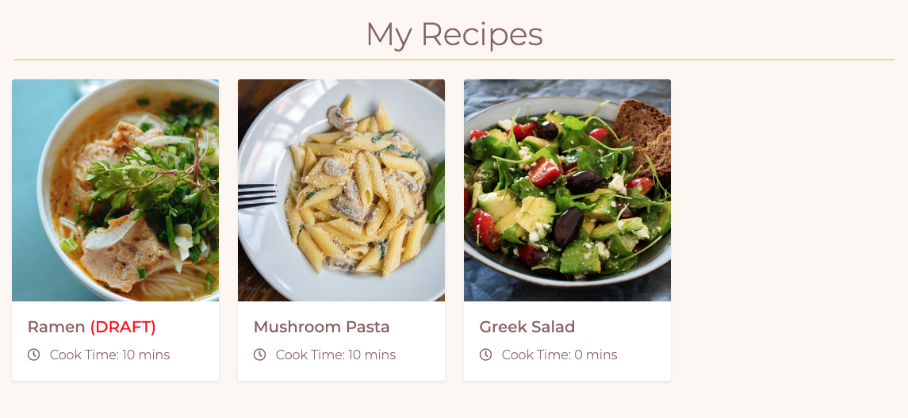

*As a Site User, I can view my bookmarked recipes so I can find them easily in the one location.*
- All the user's bookmarked recipes are available to see on the 'My Bookmarks' page.

-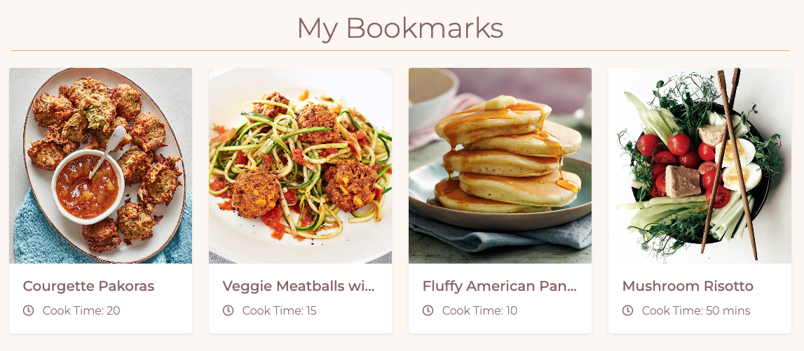

### EPIC | Recipe Interaction
*As a Site User, I can save other users' recipes to my bookmarks so that I can find them easily at a later date.*
- Each recipe has a bookmark button which can be toggled by signed in users to bookmark the recipe or remove from bookmarks.

*As a Site User, I can comment on other people's recipes so I can give my feedback.*
- Each recipe has a comment section where logged in users can leave comments on the recipe.

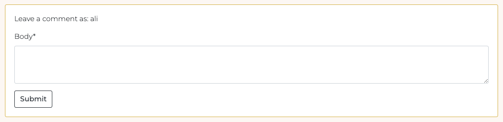

*As a Site User, I can edit and delete comments that I have created so that I can easily make changes if I have made a mistake.*
- If the logged in user is the comment author, edit and delete icon buttons will display in the comment header allowing the user to edit or delete their comments.

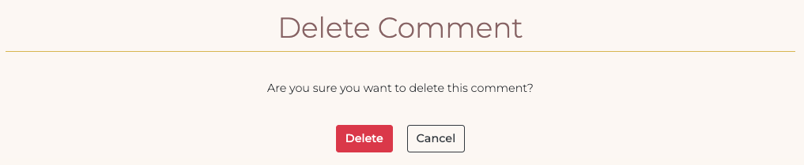

### EPIC | Mealplan Management
*As a Site User, I can add/delete recipes to my meal planner for a particular day of the week so that I can create a meal plan for the week ahead.*
- Each recipe has an 'Add to Meal Plan' button which only displays if the user is logged in.

 

- The user can choose which day of the week they want to add the recipe through a drop down menu.
- The recipe will display in the user's meal plan for the day selected.

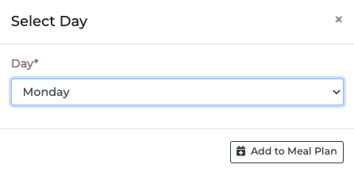

*As a Site User, I can view my meal plan for the week when I log into my account so that I can plan for the week ahead.*
- All the user's meal plan items are available to see on the 'My Meal Plan' page.

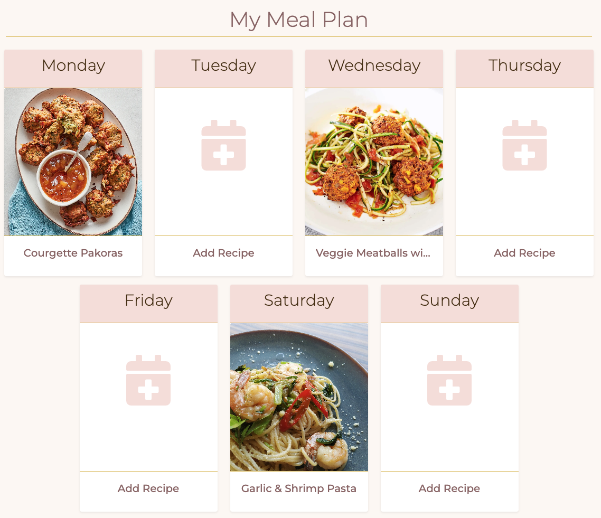

### EPIC | Site Administration
*As a Site Administrator, I can create, read, update and delete recipes, comments and meal plan items so that I can manage the app content*
-  Admins have full access to CRUD functionality for all recipes, comments and meal plans in the admin panel.

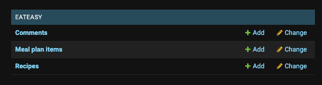

## Validator Testing

### HTML

All HTML pages were run through the [W3C HTML Validator](https://validator.w3.org/). See results in below table.

| Page                 | Logged Out | Logged In |
|----------------------|------------|-----------|
| add_recipe.html      | N/A        | Note 1    |
| base.html            | No errors  | No errors |
| browse_receipes.html | No errors  | No errors |
| delete_comment.html  | N/A        | No errors |
| delete_recipes.html  | N/A        | No errors |
| index.html           | No errors  | No errors |
| my_bookmarks.html    | N/A        | No errors |
| my_mealplan.html     | N/A        | No errors |
| my_recipes.html      | N/A        | No errors |
| paginator.html       | No errors  | No errors |
| recipe_detail.html   | No errors  | No errors |
| update_comment.html  | N/A        | No errors |
| update_recipe.html   | N/A        | Note 1    |
| login.html           | No errors  | N/A       |
| logout.html          | N/A        | No errors |
| signup.html          | No errors  | N/A       |
| 400.html             | No errors  | No errors |
| 403.html             | N/A        | No errors |
| 404.html             | No errors  | No errors |
| 500.html             | No errors  | No errors |

#### Note 1: Summernote Errors
When validating the Add Recipe and Edit Recipe forms I received a number of errors which were caused by the installed Summernote library which runs when using the form on these pages. I could not rectify these errors given that they weren't in my own code therefore they are unresolved. 

 

 
Summernote Errors

 

#### Fixed Errors
When validating the Recipe Detail page I received an error in relation to an extra `
` tag in the 'Recipe Method' field which had been created using the summernote editor. The issue was due to Summernote including `
` tags around the form field. I resolved the error by removing the surrounding `
` tags in my HTML when rendering a summernote field in my Recipe Detail page.

### CSS
No errors were found when passing my CSS file through the official [W3C CSS Validator](https://jigsaw.w3.org/css-validator/)

 

 
CSS

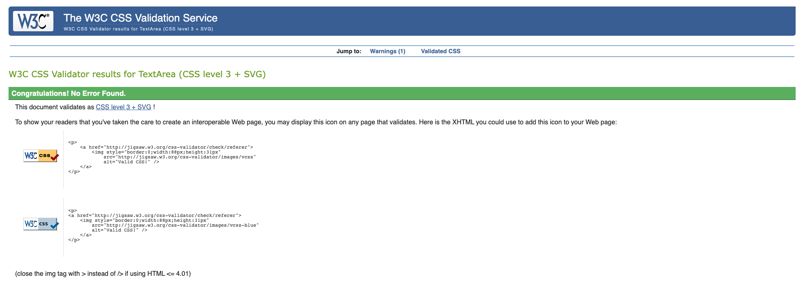
 

### Javascript
No errors were found when passing my javascript through [Jshint](https://jshint.com/) 

Jshint

### Python
All Python files were run through [Pep8](http://pep8online.com/) with no errors found. 

### Lighthouse

Lighthouse validation was run on all pages (both mobile and desktop) in order to check accessibility.
At first I received the warning *'Background and foreground colors do not have a sufficient contrast ratio'* in relation to buttons where I had used the Bootstrap class `btn-info`. 

After I updated the button styling I received 100% score on all pages. 

## Browser Testing
- The Website was tested on Google Chrome, Firefox, Safari browsers with no issues noted.
    
## Device Testing
- The website was viewed on a variety of devices such as Desktop, Laptop, iPhone10 iPhone 8, iPhoneX and iPad to ensure responsiveness on various screen sizes in both portrait and landscape mode. The website performed as intended. The responsive design was also checked using Chrome developer tools across multiple devices with structural integrity holding for the various sizes.

## Manual Testing

### Site Navigation
| Element               | Action     | Expected Result                                                    | Pass/Fail |
|-----------------------|------------|--------------------------------------------------------------------|-----------|
| NavBar                |            |                                                                    |           |
| Site Name (logo area) | Click      | Redirect to home                                                   | Pass      |
| Home Link             | Click      | Redirect to home                                                   | Pass      |
| Browse Recipes Link   | Click      | Open Browse Recipes Page                                           | Pass      |
| Add Recipe Link       | Click      | Open Add Recipe Form                                               | Pass      |
| Add Recipe Link       | Display    | Only visible if user in session                                    | Pass      |
| My Meal Plan Link     | Click      | Open My Meal Plan page                                             | Pass      |
| My Meal Plan Link     | Display    | Only visible if user in session                                    | Pass      |
| My Account Dropdown   | Click      | Open My Account dropdown                                           | Pass      |
| My Account Dropdown   | Display    | Text changes to username with profile icon when user is in session | Pass      |
| Sign Up Link          | Click      | Open Sign up page                                                  | Pass      |
| Sign Up Link          | Display    | Not visible if user in session                                     | Pass      |
| Log In Link           | Click      | Open Login page                                                    | Pass      |
| Log In Link           | Display    | Not visible if user in session                                     | Pass      |
| My Recipes Link       | Click      | Open My Recipes page                                               | Pass      |
| My Recipes Link       | Display    | Only visible if user in session                                    | Pass      |
| My Bookmarks Link     | Click      | Open My Bookmarks page                                             | Pass      |
| My Bookmarks Link     | Display    | Only visible if user in session                                    | Pass      |
| Logout Link           | Click      | Open logout confirm page                                           | Pass      |
| Logout Link           | Display    | Only visible if user in session                                    | Pass      |
| All Nav Links         | Hover      | Darken text                                                        | Pass      |
| All Nav Links         | If active  | Keep active link dark and bold                                     | Pass      |
| Navbar                | Scroll     | Remains fixed to top of page                                       | Pass      |
|                       |            |                                                                    |           |
| Mobile View           |            |                                                                    |           |
| Hamburger Menu        | Responsive | Display when screen size reduces to xxx size                       | Pass      |
| My Account Dropdown   | Responsive | Contents move into hamburger menu when size reduces size           | Pass      |
| Site Name (logo area) | Click      | Redirect to home                                                   | Pass      |
| Home Link             | Click      | Redirect to home                                                   | Pass      |
| Browse Recipes Link   | Click      | Open Browse Recipes Page                                           | Pass      |
| Sign Up Link          | Click      | Open Sign up page                                                  | Pass      |
| Sign Up Link          | Display    | Not visible if user in session                                     | Pass      |
| Log In Link           | Click      | Open Login page                                                    | Pass      |
| Log In Link           | Display    | Not visible if user in session                                     | Pass      |
| Add Recipe Link       | Click      | Open Add Recipe Form                                               | Pass      |
| Add Recipe Link       | Display    | Only visible if user in session                                    | Pass      |
| My Meal Plan Link     | Click      | Open My Meal Plan page                                             | Pass      |
| My Recipes Link       | Click      | Open My Recipes page                                               | Pass      |
| My Recipes Link       | Display    | Only visible if user in session                                    | Pass      |
| My Bookmarks Link     | Click      | Open My Bookmarks page                                             | Pass      |
| My Bookmarks Link     | Display    | Only visible if user in session                                    | Pass      |
| Logout Link           | Click      | Open logout confirm page                                           | Pass      |
| Logout Link           | Display    | Only visible if user in session                                    | Pass      |
| All Nav Links         | Hover      | Darken text                                                        | Pass      |
| All Nav Links         | If active  | Keep active link dark and bold                                     | Pass      |
|                       |            |                                                                    |           |
| Footer                |            |                                                                    |           |
| All links             | Click      | Open in new tab and to correct location                            | Pass      |

### Home Page
| Element               | Action  | Expected Result                 | Pass/Fail |
|-----------------------|---------|---------------------------------|-----------|
| Hero 'Sign Up' Button | Click   | Open Sign up page               | Pass      |
| Hero 'Sign Up' Button | Display | Not visible if user in session  | Pass      |
| Hero 'Create" Button  | Click   | Open Add Recipe page            | Pass      |
| Hero 'Create" Button  | Display | Only visible if user in session | Pass      |

### Browse Recipes Page
| Element     | Action                  | Expected Result                                                                         | Pass/Fail |
|-------------|-------------------------|-----------------------------------------------------------------------------------------|-----------|
| Recipe Card | Display correct content | Display correct image, recipe title and cooktime                                        | Pass      |
| Recipe Card | Click                   | Clicking anywhere inside the recipe card takes you to the correct recipe's detail page. | Pass      |
| Recipe Card | Pagination              | Site will paginate 8 recipe cards to a page                                             | Pass      |
| Recipe Card | Order                   | Recipes are sorted by newest to oldest                                                  | Pass      |
| Recipe Card | Hover                   | Add gold border                                                                         | Pass      |
### Recipe Detail Page

| Element                        | Action              | Expected Result                                                                                                         | Pass/Fail |
|--------------------------------|---------------------|-------------------------------------------------------------------------------------------------------------------------|-----------|
| Recipe Content                 | Display             | Display correct recipe image, title, author, prep time, cook time, description, ingredients and method                  | Pass      |
| Add to Meal Plan button        | Click               | Meal Plan modal pops up                                                                                                 | Pass      |
| Add to Meal Plan button        | Display             | Button only visible if user in session                                                                                  | Pass      |
| Bookmark button (Outline)      | Click               | Clicking the outlined bookmark changes it to a solid bookmark                                                           | Pass      |
| Bookmark button (Outline)      | Click               | Recipe is added to the user's bookmarks page                                                                            | Pass      |
| Bookmark button (Outline)      | Click               | Success message appears informing the user that the recipe has been added to their bookmarks                            | Pass      |
| Bookmark button (Outline)      | Click               | Success message fades after 3 seconds                                                                                   | Pass      |
| Bookmark button (Solid)        | Click               | Clicking the solid bookmark changes it back to an outlined bookmark                                                     | Pass      |
| Bookmark button (Solid)        | Click               | Recipe is removed from the user's bookmarks page                                                                        | Pass      |
| Bookmark button (Solid)        | Click               | Success message appears informing the user that the recipe has been removed from bookmarks                              | Pass      |
| Bookmark button (Solid)        | Click               | Success message fades after 3 seconds                                                                                   | Pass      |
| Bookmark button                | Display             | Button only visible if user in session                                                                                  | Pass      |
| Update recipe button           | Click               | Opens Update Recipe Form                                                                                                | Pass      |
| Update recipe button           | Display             | Button only visible if user is the author                                                                               | Pass      |
| Delete recipe button           | Click               | Opens Delete Recipe confirmation page                                                                                   | Pass      |
| Delete recipe button           | Display             | Button only visible if user is the author                                                                               | Pass      |
| User Comments                  | Display             | Displays correct name date time and comment body                                                                        | Pass      |
| User Comments                  | Display             | Comments are ordered oldest to newest                                                                                   | Pass      |
| Update comment button          | Display             | Button only visible if user is the comment author                                                                       | Pass      |
| Update comment button          | Click               | Opens Update Comment Form                                                                                               | Pass      |
| Update comment form            | Leave empty         | On submit: form won't submit                                                                                            | Pass      |
| Update comment form            | Leave empty         | Error message displays                                                                                                  | Pass      |
| Update comment submit button   | Click               | Form submit - page updates and comment displays in comments section with correct content                                | Pass      |
| Update comment submit button   | Click               | Success message appears informing the user that the comment has been updated                                            | Pass      |
| Update comment submit button   | Click               | Success message fades after 3 seconds                                                                                   | Pass      |
| Update comment form            | Access              | If a user tries to edit another user's comment (by changing the url) they receive a 403 error.                          | Pass      |
| Update comment form            | Access              | If a user tries to edit a comment (by changing the url) without being signed in they are redirected to the login page   | Pass      |
| Delete comment button          | Display             | Button only visible if user is the comment author                                                                       | Pass      |
| Delete comment button          | Click               | Opens delete comment confirmation page                                                                                  | Pass      |
| Confirm delete button          | Click               | Comment is removed from comment section                                                                                 | Pass      |
| Confirm delete button          | Click               | Success message appears informing the user that the comment has been deleted                                            | Pass      |
| Confirm delete button          | Click               | Success message fades after 3 seconds                                                                                   | Pass      |
| Confirm delete button          | Click               | Redirect user back to recipe page                                                                                       | Pass      |
| Cancel delete button           | Click               | Redirect user back to recipe page                                                                                       | Pass      |
| Delete comment                 | Access              | If a user tries to delete another user's comment (by changing the url) they receive a custom 403 error.                 | Pass      |
| Delete comment                 | Access              | If a user tries to delete a comment (by changing the url) without being signed in they are redirected to the login page | Pass      |
| Add comment Form               | Display             | Form only visible if user in session                                                                                    | Pass      |
| Add comment Form submit button | Click               | On submit: form won't submit                                                                                            | Pass      |
| Add comment Form submit button | Click               | Error message displays                                                                                                  | Pass      |
| Add comment Form submit button | Click               | Form submit - page updates and comment displays in comments section with correct content                                | Pass      |
| Add comment Form submit button | Click               | Success message appears informing the user that the comment has been added                                              | Pass      |
| Add comment Form submit button | Click               | Success message fades after 3 seconds                                                                                   | Pass      |
|                                |                     |                                                                                                                         |           |
| Meal plan model                |                     |                                                                                                                         |           |
| Modal cancel button            | Click               | Close modal                                                                                                             | Pass      |
| Days drop down menu            | Click               | Display list of the days of the week                                                                                    | Pass      |
| Days drop down menu            | Click               | Default day is Monday                                                                                                   | Pass      |
| Add to Meal Plan submit button | Click               | Form Submit                                                                                                             | Pass      |
| Add to Meal Plan submit button | Click               | Correct recipe is added to the user's Meal Plan page for the correct day                                                | Pass      |
| Add to Meal Plan submit button | Click               | Success message appears telling the user that the recipe has been added to their meal plan                              | Pass      |
| Add to Meal Plan submit button | Click               | Success message fades after 3 seconds                                                                                   | Pass      |
| Add to Meal Plan submit button | Click               | If meal plan item already exists for that day, the success message tells the user that meal plan has been updated       | Pass      |
| Add to Meal Plan submit button | Click               | Modal closes                                                                                                            | Pass      |
| Meal Plan modal                | Click outside modal | Close modal                                                                                                             | Pass      |
### Add Recipe Page
| Element                       | Action                | Expected Result                                                                                                     | Pass/Fail |
|-------------------------------|-----------------------|---------------------------------------------------------------------------------------------------------------------|-----------|
| Add Recipe                    | Access                | If a user tries to add a recipe (by changing the url) without being signed in they are redirected to the login page | Pass      |
| Form Text Input (if required) | Leave blank           | On Submit: Warning appears, form won't submit                                                                       | Pass      |
| Form Text Input (if required) | Just input whitespace | On Submit: Form won't submit                                                                                        | Pass      |
| Recipe Title                  | Duplicate Entry       | On Submit: Warning appears, form won't submit                                                                       | Pass      |
| Form image select button      | Click                 | Open device storage                                                                                                 | Pass      |
| Form image select button      | Display               | Chosen image name displayed once selected                                                                           | Pass      |
| Form image select button      | Display               | Default image is used if no image is selected                                                                       | Pass      |
| Cancel button                 | Click                 | Redirect to Browse Recipes page                                                                                     | Pass      |
| Add Recipe button(form valid) | Click                 | Form submit                                                                                                         | Pass      |
| Add Recipe button(form valid) | Click                 | Redirect to Recipe detail page for new recipe with all information displaying correctly                             | Pass      |
| Add Recipe button(form valid) | Click                 | Success message appears informing the user that the recipe has been created                                         | Pass      |
| Add Recipe button(form valid) | Click                 | Success message fades after 3 seconds                                                                               | Pass      |
### Edit Recipe Page
| Element            | Action  | Expected Result                                                                                                         | Pass/Fail |
|--------------------|---------|-------------------------------------------------------------------------------------------------------------------------|-----------|
| Update Recipe      | Access  | If a user tries to edit another user's recipe (by changing the url) they receive a custom 403 error. (forbidden access) | Pass      |
| Update Recipe      | Access  | If a user tries to edit a recipe (by changing the url) without being signed in they are redirected to the login page    | Pass      |
| Update Recipe Form | Display | Form has all the fields filled out with the original content                                                            | Pass      |
| Update Button      | Click   | Updated recipe is saved                                                                                                 | Pass      |
| Update Button      | Click   | Success message appears telling the user that the recipe has been successfully updated                                  | Pass      |
| Update Button      | Click   | Success message fades after 3 seconds                                                                                   | Pass      |
| Update Button      | Click   | User is redirected back to the current recipe page                                                                      | Pass      |
| Cancel Button      | Click   | User is redirected back to the current recipe page                                                                      | Pass      |
### Confirm Delete Recipe Page
| Element       | Action | Expected Result                                                                                                        | Pass/Fail |
|---------------|--------|------------------------------------------------------------------------------------------------------------------------|-----------|
| Delete recipe | Access | If a user tries to delete another user's recipe (by changing the url) they receive a custom 403 error.                 | Pass      |
| Delete recipe | Access | If a user tries to delete a recipe (by changing the url) without being signed in they are redirected to the login page | Pass      |
| Delete Button | Click  | Recipe is deleted and removed from user recipes page                                                                   | Pass      |
| Delete Button | Click  | Success message appears telling the user that the recipe has been successfully deleted                                 | Pass      |
| Delete Button | Click  | User is redirected back to the My recipes page                                                                         | Pass      |
| Cancel Button | Click  | Redirect to current recipe page                                                                                        | Pass      |

### My Recipes Page
| Element         | Action               | Expected Result                                                                                                  | Pass/Fail |
|-----------------|----------------------|------------------------------------------------------------------------------------------------------------------|-----------|
| My Recipes Page | Access               | If a user tries to access this page (by changing url) without being signed in they are redirected to the Login page | Pass      |
| My Recipes Page | Display              | Only displays the recipes that the user is the author for                                                        | Pass      |
| Recipe Card     | Show Status          | Show if recipe is draft or published                                                                             | Pass      |
| Recipe Card     | Card Content Display | Display correct image, recipe title and cooktime                                                                 | Pass      |
| Recipe Card     | Click                | Clicking anywhere inside the recipe card takes you to the correct recipe's detail page.                          | Pass      |
| Recipe Card     | Pagination           | Site will paginate 8 recipe cards to a page                                                                      | Pass      |
| Recipe Card     | Order                | Recipes are sorted by newest to oldest                                                                           | Pass      |
| Recipe Card     | Hover                | Display gold border                                                                                              | Pass      |
### My Bookmarks Page

| Element           | Action               | Expected Result                                                                                                  | Pass/Fail |
|-------------------|----------------------|------------------------------------------------------------------------------------------------------------------|-----------|
| My Bookmarks Page | Access               | If a user tries to access this page (by changing url) without being signed in they are redirected the Login page | Pass      |
| My Bookmarks Page | Display              | Only the recipes the user has book marked are shown                                                              | Pass      |
| Recipe Card       | Card Content Display | Display correct image, recipe title and cook time                                                                | Pass      |
| Recipe Card       | Click                | Clicking anywhere inside the recipe card takes you to the correct recipe's detail page.                          | Pass      |
| Recipe Card       | Pagination           | Site will paginate 8 recipe cards to a page                                                                      | Pass      |
| Recipe Card       | Order                | Recipes are sorted by newest to oldest                                                                           | Pass      |
| Recipe Card       | Hover                | Display gold border                                                                                              | Pass      |
### My Meal Plan Page
| Element           | Action               | Expected Result                                                                                                  | Pass/Fail |
|-------------------|----------------------|------------------------------------------------------------------------------------------------------------------|-----------|
| My Meal Plan Page | Access               | If a user tries to access this page (by changing url) without being signed in they are redirected the Login page | Pass      |
| Meal Plan card    | Order                | Cards are ordered from Monday to Sunday                                                                          | Pass      |
| Meal Plan card    | Card Content Display | If populated: Display correct image, recipe title                                                                | Pass      |
| Meal Plan card    | Card Content Display | If unpopulated: display placeholder image and 'Add Recipe'                                                       | Pass      |
| Meal Plan card    | Click                | If populated: clicking anywhere inside the recipe card takes you to the detailed page for that recipe            | Pass      |
| Meal Plan card    | Click                | If unpopulated:  clicking anywhere inside the recipe card takes you to the browse recipes page                   | Pass      |
| Meal Plan card    | Hover                | Display gold border                                                                                              | Pass      |

### Django All Auth Pages
| Element                    | Action                                    | Expected Result                            | Pass/Fail |
|----------------------------|-------------------------------------------|--------------------------------------------|-----------|
| Sign Up                    |                                           |                                            |           |
| Log in link                | Click                                     | Redirect to login page                     | Pass      |
| Username field             | Leave empty                               | On submit: form won't submit               | Pass      |
| Username field             | Leave empty                               | Error message displays                     | Pass      |
| Username field             | Insert correct format                     | On submit: form submit                     | Pass      |
| Username field             | Insert duplicate username                 | On submit: form won't submit               | Pass      |
| Username field             | Insert duplicate username                 | Error message displays                     | Pass      |
| Email field                | Insert incorrect format                   | On submit: form won't submit               | Pass      |
| Email field                | Insert incorrect format                   | Error message displays                     | Pass      |
| Email field                | Insert correct format                     | On submit: form submit                     | Pass      |
| Email field                | Leave empty                               | On submit: form submit                     | Pass      |
| Email field                | Insert duplicate email                    | On submit: form won't submit               | Pass      |
| Email field                | Insert duplicate email                    | Error message displays                     | Pass      |
| Password field             | Insert incorrect format                   | On submit: form won't submit               | Pass      |
| Password field             | Insert incorrect format                   | Error message displays                     | Pass      |
| Password field             | Passwords don't match                     | On submit: form won't submit               | Pass      |
| Password field             | Passwords don't match                     | Error message displays                     | Pass      |
| Password field             | Insert correct format and passwords match | On submit: form submit                     | Pass      |
| Sign Up button(form valid) | Click                                     | Form submit                                | Pass      |
| Sign Up button(form valid) | Click                                     | Redirect to home page                      | Pass      |
| Sign Up button(form valid) | Click                                     | Success message confirming login appears   | Pass      |
| Sign Up button(form valid) | Click                                     | Success message fades after 3 seconds      | Pass      |
|                            |                                           |                                            |           |
| Log in                     |                                           |                                            |           |
| Sign up link               | Click                                     | Redirect to sign up page                   | Pass      |
| Username field             | Leave empty                               | On submit: form won't submit               | Pass      |
| Username field             | Leave empty                               | Error message displays                     | Pass      |
| Username field             | Insert wrong username                     | On submit: form won't submit               | Pass      |
| Username field             | Insert wrong username                     | Error message displays                     | Pass      |
| Password field             | Leave empty                               | On submit: form won't submit               | Pass      |
| Password field             | Leave empty                               | Error message displays                     | Pass      |
| Password field             | Insert wrong password                     | On submit: form won't submit               | Pass      |
| Password field             | Insert wrong password                     | Error message displays                     | Pass      |
| Login button(form valid)   | Click                                     | Form submit                                | Pass      |
| Login button(form valid)   | Click                                     | Redirect to home page                      | Pass      |
| Login button(form valid)   | Click                                     | Success message confirming login appears   | Pass      |
| Login button(form valid)   | Click                                     | Success message fades after 3 seconds      | Pass      |
|                            |                                           |                                            |           |
| Log Out Confirmation       |                                           |                                            |           |
| Logout button              | Click                                     | Redirect to homepage                       | Pass      |
| Logout button              | Click                                     | Success message confirming log out appears | Pass      |
| Logout button              | Click                                     | Success message fades after 3 seconds      | Pass      |

## Bugs 

### Fixed Bugs

- #### Overwrite Meal Plan Items
     - **Bug**: When I initially wrote the code to add a recipe to a meal plan item, if a meal plan item already existed for the current user for a particular day and then they added another recipe to that day, the meal plan item wouldn't update and the user's meal plan would still display the original meal plan item for that day.
     - **Fix**: in order to rectify this I queried the database to return all meal plan items for the current user and for the day selected. Through an if statement I could then check if a meal plan item already existed for the user for that day, and if it did then to overwrite it. 
This solved the problem whereby now if a user adds a meal plan item to a particular day, it just overwrites the previous meal plan item. 

- #### Required fields using Summernote extension submit with just whitespace entered
     - **Bug**: In the Add Recipe form, the Ingredients and Method fields both use the summernote extension. Both fields are required fields however the form still submitted when only whitespace was entered due to summernote rendering the html `
&nbsp; &nbsp; &nbsp; &nbsp; &nbsp;&nbsp;
` on submit and therefore the form validation didn't pick up the empty field. 
     - **Fix**: My first attempt at the solution was to write a custom django `clean_<fieldname>() method` which would replace any `&nbsp` with blank, `strip()` whitespace and `strip_tags()`. The solution did prevent the form submitting with only whitespace however it wasn't a good solution due to fact that stripping the HTML tags meant the summernote editor didn't format valid inputs as expected. 
     - After posting the question on Slack Ian Meigh_5P proposed a working solution to create a custom validator for textfields and implement this in the Model. I have utilised Ian's custom validator in my code [here](eateasy/validators.py) and have credited him in my Readme. Thanks Ian!

- #### No Reverse Match Error
     - **Bug**: When I first implemented the Add Recipe form I kept getting a no reverse match error when trying to submit a new recipe due to the slug field not populating properly. 
     - **Fix**: After some research on stack overflow I learned about AutoSlugField which is a Django Model Field extension which will automatically create a unique slug and you can choose which field to populate the slug from. Utilising this extension I was able to create a unique slug populated from the recipe title.

- #### Cloudinary Images not Displaying
     - **Bug**: Cloudinary images not displaying after uploading. 
     - **Fix**: After searching the issue on slack I realised that I needed to include enctype="multipart/form-data in the opening form HTML tag and this solved the problem. 

- #### Footer not staying at bottom of screen
     - **Bug**: Footer not staying at the bottom of the screen when displaying on pages without fullscreen content and didn't want to use a sticky footer. 
     - **Fix**: Was able to utilise the calc() CSS function and make the page content 100% of the viewport height less the height of the footer and this solved the problem. 

### Unfixed bugs:
There are no known unfixed bugs. 
